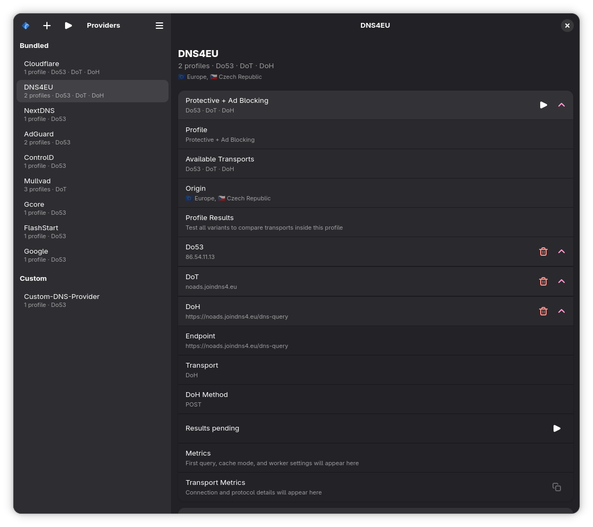

# DNS Tester

DNS Tester is a GTK4/Libadwaita desktop app for comparing recursive DNS providers across `Do53`, `DoT`, and `DoH` with a methodology that tries to stay fair to encrypted transports.



## Features

- Real transport-specific benchmarking for `Do53`, `DoT`, and `DoH`.
- Shared benchmark settings for all rows so every resolver uses the same domain list and workload.
- Optional warm cache mode backed by `dns.resolver.Cache()`.
- Warm-up phase before the measured run to reduce handshake and connection cold-start bias.
- Reused connections for encrypted DNS:
  - persistent HTTP client for `DoH`
  - persistent TLS streams for `DoT`
- Concurrency control for the measured phase.
- Persistent DNS entry management:
  - removed bundled resolvers stay hidden after restart
  - custom resolvers reappear after restart
- Per-run structured metrics:
  - first-query latency
  - average latency
  - p95 latency
  - success rate
  - transport-specific connection metrics
- Structured JSON export by copying the last result from each row.

## Benchmark Methodology

Each resolver is tested against the same domain list from `src/aux.py`. The app uses one benchmark configuration shared by every row:

- identical query type
- identical warm-up count
- identical worker concurrency
- identical cache mode

This avoids comparing one provider with a larger or easier workload than another.

### Transport Support

- `Do53`: classic DNS over UDP with TCP fallback handled by dnspython.
- `DoT`: DNS over TLS on port `853`, using persistent TLS connections during the run.
- `DoH`: DNS over HTTPS with RFC 8484 semantics using the `application/dns-message` media type.
  - `POST` is the default mode
  - `GET` is also supported for compatible endpoints

### Warm-up and Measurement

The benchmark is split into phases:

1. `Preflight`
   Validates that the resolver endpoint is reachable and that the selected transport works before spending time on the full workload.
2. `Warm-up`
   Sends a small number of uncaptured queries so connection pools, TLS sessions, and HTTP/2 state are no longer cold.
3. `Cache prime` (optional)
   Fills the local cache when warm-cache mode is enabled.
4. `Measured phase`
   Runs the actual benchmark and computes the reported metrics.

### Reported Metrics

- `First query latency`
  The first measured lookup in the shared domain list.
- `Average latency`
  Arithmetic mean of successful measured queries.
- `P95 latency`
  A tail-latency indicator that is more useful than a simple worst-case spike.
- `Success rate`
  Percentage of successful measured queries.
- `Connection setup`
  For encrypted transports, the initial TCP/TLS setup measured separately from the benchmark loop.
- `TTFB`
  For `DoH`, the average time to first response byte during the measured phase.

## Cold vs Warm Cache

`dnspython` does not cache recursively by default. DNS Tester exposes that choice explicitly:

- `Cold`
  No local cache. Every measured query goes to the network.
- `Warm`
  A local `dns.resolver.Cache()` is primed before the measured phase, so the benchmark reflects cache-hit latency instead of network latency.

Warm runs are useful, but they answer a different question. Comparing a warm run against a cold run is not an apples-to-apples transport comparison.

## Why Naive DoH Benchmarks Look Worse

Encrypted DNS often looks artificially slow when tools do any of the following:

- open a fresh HTTPS connection for every DoH query
- skip warm-up and therefore measure TLS and HTTP cold-start penalties repeatedly
- compare different providers instead of the same backend exposed over different transports
- mix cache hits and network misses in the same summary

That kind of benchmark punishes `DoH` for connection setup overhead that disappears once persistent HTTP sessions are reused. `DoT` has the same problem if every query opens a new TLS socket.

DNS Tester tries to avoid that bias by:

- reusing one shared HTTP client for `DoH`
- reusing TLS streams for `DoT`
- warming up the transport before measuring
- applying the same domain list to every resolver row

## Fair Comparison Rules

For a realistic comparison:

- compare the same provider across transports
  - example: Cloudflare `Do53` vs Cloudflare `DoT` vs Cloudflare `DoH`
- keep cache mode identical across rows
- keep warm-up and concurrency identical across rows
- avoid comparing a filtered resolver with an unfiltered resolver unless that is the actual goal

The bundled defaults include matched transport variants for providers such as Cloudflare and DNS4EU to make fair comparisons easier.

## Limitations

- Network conditions, Wi-Fi congestion, and routing changes can dominate small latency differences.
- Different transports from the same brand may still hit different anycast edges or backend infrastructure.
- `Do53` remains the lightest protocol in raw transport overhead, so encrypted transports may still be slower even with proper connection reuse.
- Warm-cache mode measures local cache-hit speed, not network resolver speed.
- The current app is UI-first; there is no separate command-line benchmark runner yet.

## Download, Install, and Use (Flatpak)

1. Download the latest `.flatpak` bundle from the releases page:
   https://github.com/Neikon/dns_tester/releases
2. Install the bundle:

```bash
flatpak install --user ./dns_tester.flatpak
```

3. Launch the app:

```bash
flatpak run es.neikon.dns_tester
```

## Development Notes

- UI: GTK 4 + Libadwaita
- DNS library: `dnspython`
- HTTP client for `DoH`: `httpx` with HTTP/2 enabled
- License: GPL-3.0-or-later
- Repository and issues: https://github.com/Neikon/dns_tester

## Roadmap

- [ ] Add a dedicated export action for saving benchmark JSON to disk.
- [ ] Add a CLI entry point that reuses the same benchmark engine as the GTK app.
